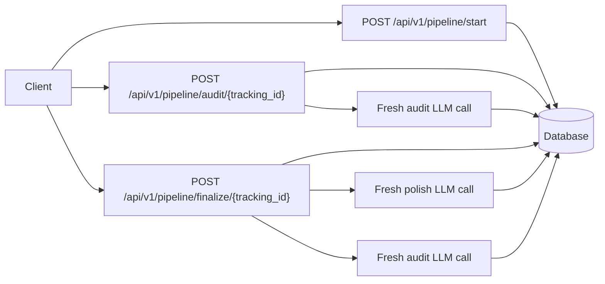

# VideoEdgeAI-Task

An air-gapped FastAPI pipeline that takes a rough idea, audits it with a fresh LLM call,
polishes it, and repeats until a new audit declares the text ready.

## Why Air-Gap?

Long LLM chats can become biased by their own earlier answers: the model remembers what it
changed and may defend that direction instead of judging the text cleanly. This service keeps each
audit and polish step stateless. The only continuity is the database record keyed by `tracking_id`,
which makes the refinement loop easier to inspect, replay, and reason about.

## Architecture



The implementation records every text version, audit, and LLM call. That history is available
through `GET /api/v1/pipeline/{tracking_id}` so a reviewer can verify that each step is independent.
For a compact summary, `GET /api/v1/pipeline/{tracking_id}/metrics` returns version counts, audit
counts, LLM call success, word delta, the latest perfection verdict, and an air-gap trace flag.
The detailed run endpoint also exposes each LLM call's prompt version, exact request payload,
provider parameters, model name, input text version, and output text version when applicable.
`GET /api/v1/pipeline/{tracking_id}/review` compares the original and current text with a small
deterministic rubric so the final "is this better?" question can be inspected through the API.
`GET /api/v1/pipeline/{tracking_id}/report` returns a compact Markdown handoff report with the
decision, score deltas, trace evidence, prompt versions, providers, and next checks.

## Quick Start

```bash
python -m venv .venv
.venv\Scripts\activate
python -m pip install -e ".[dev]"
uvicorn videoedgeai_task.main:app --reload
```

Open the reviewer console:

```text
http://127.0.0.1:8000/
```

The console uses the server default provider first. If `GEMINI_API_KEY` is configured and
`LLM_PROVIDER` is not set, the server default is Gemini; otherwise it safely falls back to Mock.
Reviewers can also switch the same Audit/Finalize/Full Pipeline buttons to Gemini, GPT, Claude,
Ollama, or Mock from the UI. API keys are used only for that request and are not written to the
database or trace log.

On Windows, the safest way to start the console from any terminal directory is:

```powershell
.\scripts\run_reviewer_console.ps1
```

If PowerShell execution policy blocks scripts, use:

```bat
scripts\run_reviewer_console.cmd
```

Then run:

```bash
curl -X POST http://127.0.0.1:8000/api/v1/pipeline/start ^
  -H "Content-Type: application/json" ^
  -d "{\"text\":\"make a tool that helps founders clean up messy product notes\"}"
```

Docker path:

```bash
docker compose up --build
```

Run the deterministic mock demo:

```bash
python scripts/demo.py
```

Run a local Ollama smoke test:

```bash
ollama pull llama3.2:3b
python scripts/ollama_smoke.py
```

Run a multi-metric evaluation report:

```bash
python scripts/evaluate_metrics.py
```

This writes `outputs/evaluation_report.md` and `outputs/evaluation_metrics.json`. The report
compares `original_input`, `fixed_template`, and `pipeline_mock` baselines and explains what each
proxy metric does and does not prove. A committed snapshot is available in
`docs/EVALUATION_RESULTS.md` for reviewers who inspect the GitHub repo without running the project.

Run the offline prompt-variant evaluation:

```bash
python scripts/evaluate_prompt_variants.py
```

This writes `outputs/prompt_variant_report.md` and documents why the selected audit/polish prompts
use strict JSON for audit and final-text-only output for polish. The same decision summary is
included in `docs/EVALUATION_RESULTS.md`.

Run the full quality gate:

```bash
python scripts/quality_gate.py
```

Run checks:

```bash
pytest
ruff check .
mypy src
```

## API

### `POST /api/v1/pipeline/start`

Request:

```json
{"text": "raw idea text"}
```

Response:

```json
{"tracking_id": "84a9c641-fb0a-4fc9-8e6f-0f02e6d4e1aa"}
```

### `POST /api/v1/pipeline/audit/{tracking_id}`

Returns the current fresh-audit verdict: `is_perfect`, `quality_score`, `rationale`,
`suggestions`, and `needs_polish`.

Optional per-request provider override:

```json
{"provider": "mock"}
```

```json
{"provider": "ollama", "ollama_model": "llama3.2:3b"}
```

```json
{
  "provider": "openai_compatible",
  "openai_base_url": "http://127.0.0.1:1234/v1",
  "openai_model": "local-model"
}
```

```json
{
  "provider": "gemini",
  "gemini_api_key": "...",
  "gemini_model": "gemini-2.0-flash"
}
```

```json
{
  "provider": "openai",
  "openai_api_key": "sk-...",
  "openai_model": "gpt-4.1-mini"
}
```

```json
{
  "provider": "claude",
  "anthropic_api_key": "...",
  "anthropic_model": "claude-sonnet-4-5"
}
```

### `POST /api/v1/pipeline/finalize/{tracking_id}`

Runs polish and fresh audit calls until a new audit returns `is_perfect=true` or
`MAX_ITERATIONS` is hit.

Accepts the same optional provider override body as `audit`.

### `GET /api/v1/pipeline/{tracking_id}`

Returns the run, text versions, audit records, and LLM call metadata.

### `GET /api/v1/pipeline/{tracking_id}/metrics`

Returns compact traceability metrics for versions, audits, LLM calls, word delta, latest verdict,
and air-gap proof.

### `GET /api/v1/pipeline/{tracking_id}/review`

Returns an original-vs-current comparison with deterministic review scores:

- `structure_coverage`: whether the reviewer labels are present.
- `faithfulness_recall`: how many meaningful original words remain represented.
- `clarity_proxy_score`: reviewable length and paragraph structure.
- `actionability_score`: presence of a next step and success measure.
- `quality_proxy_score`: a compact average of the above signals.

The response also includes `likely_better_than_original`, `decision_rationale`, and
`air_gap_trace_ok`. These are intentionally review aids, not a replacement for human judgment.

### `GET /api/v1/pipeline/{tracking_id}/report`

Returns a reviewer-ready Markdown report plus structured metadata:

- `summary`: whether the run is ready for handoff.
- `markdown`: original text, current text, score table, latest audit verdict, and trace evidence.
- `recommended_next_checks`: concrete follow-up checks before submission.
- `prompt_versions` and `providers`: quick provenance for the LLM calls used in the run.

## LLM Providers

If `GEMINI_API_KEY` is present and `LLM_PROVIDER` is not set, Gemini becomes the server default.
If no real key is configured, the service falls back to deterministic Mock mode.

Server-default Gemini mode:

```env
GEMINI_API_KEY=...
GEMINI_MODEL=gemini-2.0-flash
```

Deterministic offline mode:

```env
LLM_PROVIDER=mock
```

Optional OpenAI mode:

```env
LLM_PROVIDER=openai
OPENAI_API_KEY=sk-...
OPENAI_MODEL=gpt-4.1-mini
```

Optional Claude mode:

```env
LLM_PROVIDER=claude
ANTHROPIC_API_KEY=...
ANTHROPIC_MODEL=claude-sonnet-4-5
```

Free local Ollama mode:

```env
LLM_PROVIDER=ollama
OLLAMA_BASE_URL=http://127.0.0.1:11434
OLLAMA_MODEL=llama3.2:3b
```

OpenAI-compatible mode for local or hosted gateways:

```env
LLM_PROVIDER=openai_compatible
OPENAI_BASE_URL=http://127.0.0.1:1234/v1
OPENAI_MODEL=local-model
OPENAI_API_KEY=local
```

The mock provider is intentional for deterministic reviewer demos. Ollama is the preferred
credential-free real LLM path, Gemini/GPT/Claude cover hosted production-grade providers, and
OpenAI-compatible mode lets a reviewer connect their own local or hosted model without changing
application code.

## Example Run

Input:

```text
make a tool that helps busy founders turn messy product notes into clearer pitches
```

First audit:

```json
{
  "is_perfect": false,
  "quality_score": 50,
  "rationale": "The idea is promising but not yet submission-ready.",
  "suggestions": [
    "Rewrite the idea as a reviewer-ready brief with Problem, Audience, Value, Next step, and Success measure.",
    "Add enough concrete context so a reviewer can understand the user, problem, benefit, and decision point.",
    "Add a measurable criterion for deciding whether the idea is better."
  ],
  "needs_polish": true
}
```

Final output after one polish iteration:

```text
Problem: Early-stage founders collect useful notes but struggle to turn them into a clear, reviewable next action.

Audience: Early-stage founders who turn rough notes into product decisions or pitches.

Value: The service turns messy product notes into a clearer pitch or roadmap input.

Next step: Test this brief with one target user using the original idea: make a tool that helps busy founders turn messy product notes into clearer pitches.

Success measure: A reviewer can identify the user, problem, benefit, next step, and evaluation criterion without asking follow-up questions.
```

## Observations

With the deterministic mock provider, the loop converges quickly because the audit criteria are
explicit and the polish step satisfies them in one structured rewrite. In a real LLM run, I would
expect most short ideas to converge in one to three iterations; beyond that, repeated suggestions
often become stylistic rather than substantive. Air-gapped refinement makes that behavior visible:
each audit is a clean judgment of the latest text, not a continuation of the model's previous
justification.

The mock metrics should be read as engineering guardrails, not as proof of real writing quality.
They verify traceability, convergence behavior, schema handling, and baseline deltas. Real quality
needs rubric-based human review or a frozen evaluator model on representative inputs.

## Is The Final Version Actually Better?

I would compare original and final text with a small rubric:

- Specificity: can a reviewer identify the user, problem, value, and next action?
- Clarity: does the text reduce ambiguity without adding fluff?
- Usefulness: does the final version support a decision or experiment?
- Faithfulness: does it preserve the original intent?
- Reviewer score: ask two humans to choose which version is more actionable and why.

For production, I would store these rubric scores alongside versions and use them to detect whether
the pipeline is only making text longer or genuinely making it easier to evaluate.

This implementation now exposes the same kind of check at:

```text
GET /api/v1/pipeline/{tracking_id}/review
```

The endpoint returns the original and current scores, the quality delta, a likely-better flag, and
the air-gap trace status. I would still pair that with human review before claiming objective
quality improvement.
