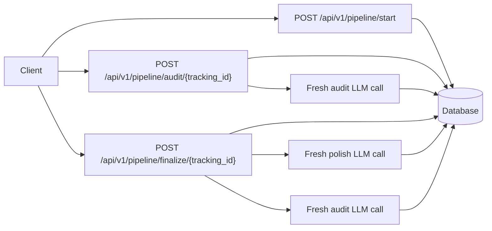

# VideoEdgeAI-Task

An air-gapped FastAPI pipeline that takes a rough idea, audits it with a fresh LLM call,
polishes it, and repeats until there are no suggestions left.

## Why Air-Gap?

Long LLM chats can become biased by their own earlier answers: the model remembers what it
changed and may defend that direction instead of judging the text cleanly. This service keeps each
audit and polish step stateless. The only continuity is the database record keyed by `tracking_id`,
which makes the refinement loop easier to inspect, replay, and reason about.

## Architecture



The implementation records every text version, audit, and LLM call. That history is available
through `GET /api/v1/pipeline/{tracking_id}` so a reviewer can verify that each step is independent.
For a compact summary, `GET /api/v1/pipeline/{tracking_id}/metrics` returns version counts, audit
counts, LLM call success, word delta, and an air-gap trace flag.
The detailed run endpoint also exposes each LLM call's prompt version, exact request payload,
provider parameters, model name, input text version, and output text version when applicable.

## Quick Start

```bash
python -m venv .venv
.venv\Scripts\activate
python -m pip install -e ".[dev]"
uvicorn videoedgeai_task.main:app --reload
```

Then run:

```bash
curl -X POST http://127.0.0.1:8000/api/v1/pipeline/start ^
  -H "Content-Type: application/json" ^
  -d "{\"text\":\"make a tool that helps founders clean up messy product notes\"}"
```

Docker path:

```bash
docker compose up --build
```

Run the deterministic mock demo:

```bash
python scripts/demo.py
```

Run a multi-metric evaluation report:

```bash
python scripts/evaluate_metrics.py
```

This writes `outputs/evaluation_report.md` and `outputs/evaluation_metrics.json`. The report
compares `original_input`, `fixed_template`, and `pipeline_mock` baselines and explains what each
proxy metric does and does not prove. A committed snapshot is available in
`docs/EVALUATION_RESULTS.md` for reviewers who inspect the GitHub repo without running the project.

Run the offline prompt-variant evaluation:

```bash
python scripts/evaluate_prompt_variants.py
```

This writes `outputs/prompt_variant_report.md` and documents why the selected audit/polish prompts
use strict JSON for audit and final-text-only output for polish. The same decision summary is
included in `docs/EVALUATION_RESULTS.md`.

Run the full quality gate:

```bash
python scripts/quality_gate.py
```

Run checks:

```bash
pytest
ruff check .
mypy src
```

## API

### `POST /api/v1/pipeline/start`

Request:

```json
{"text": "raw idea text"}
```

Response:

```json
{"tracking_id": "84a9c641-fb0a-4fc9-8e6f-0f02e6d4e1aa"}
```

### `POST /api/v1/pipeline/audit/{tracking_id}`

Returns the current audit suggestions and `needs_polish`.

### `POST /api/v1/pipeline/finalize/{tracking_id}`

Runs polish and fresh audit calls until the audit returns no suggestions or `MAX_ITERATIONS` is hit.

### `GET /api/v1/pipeline/{tracking_id}`

Returns the run, text versions, audit records, and LLM call metadata.

### `GET /api/v1/pipeline/{tracking_id}/metrics`

Returns compact traceability metrics for versions, audits, LLM calls, word delta, and air-gap proof.

## LLM Providers

Default mode is deterministic and offline:

```env
LLM_PROVIDER=mock
```

Optional OpenAI mode:

```env
LLM_PROVIDER=openai
OPENAI_API_KEY=sk-...
OPENAI_MODEL=gpt-4.1-mini
```

The mock provider is intentional: reviewers can run the full workflow without credentials, while
the provider interface keeps the production LLM integration isolated.

## Example Run

Input:

```text
make a tool that helps busy founders turn messy product notes into clearer pitches
```

First audit:

```json
{
  "suggestions": [
    "Restructure the idea with Problem, Audience, Value, Next step, and Success measure.",
    "Add enough concrete context for a reviewer to understand the idea.",
    "Add a measurable way to decide whether the idea improved."
  ],
  "needs_polish": true
}
```

Final output after one polish iteration:

```text
Polished idea

Problem: make a tool that helps busy founders turn messy product notes into clearer pitches

Audience: The people or team who feel this problem directly and need a clearer way to act on the idea.

Value: The idea is easier to evaluate because it states the problem, the intended audience, the practical benefit, and the next decision point.

Next step: Test the idea with one realistic user scenario, then revise the wording based on what felt unclear or unsupported.

Success measure: A reviewer can identify the user, problem, benefit, next step, and evaluation criterion without asking follow-up questions.
```

## Observations

With the deterministic mock provider, the loop converges quickly because the audit criteria are
explicit and the polish step satisfies them in one structured rewrite. In a real LLM run, I would
expect most short ideas to converge in one to three iterations; beyond that, repeated suggestions
often become stylistic rather than substantive. Air-gapped refinement makes that behavior visible:
each audit is a clean judgment of the latest text, not a continuation of the model's previous
justification.

The mock metrics should be read as engineering guardrails, not as proof of real writing quality.
They verify traceability, convergence behavior, schema handling, and baseline deltas. Real quality
needs rubric-based human review or a frozen evaluator model on representative inputs.

## Is The Final Version Actually Better?

I would compare original and final text with a small rubric:

- Specificity: can a reviewer identify the user, problem, value, and next action?
- Clarity: does the text reduce ambiguity without adding fluff?
- Usefulness: does the final version support a decision or experiment?
- Faithfulness: does it preserve the original intent?
- Reviewer score: ask two humans to choose which version is more actionable and why.

For production, I would store these rubric scores alongside versions and use them to detect whether
the pipeline is only making text longer or genuinely making it easier to evaluate.
